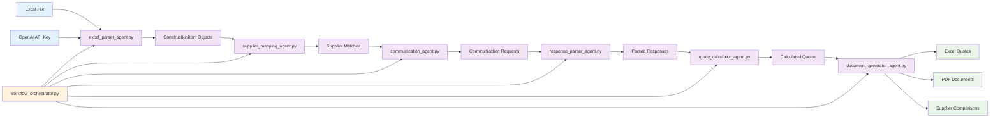
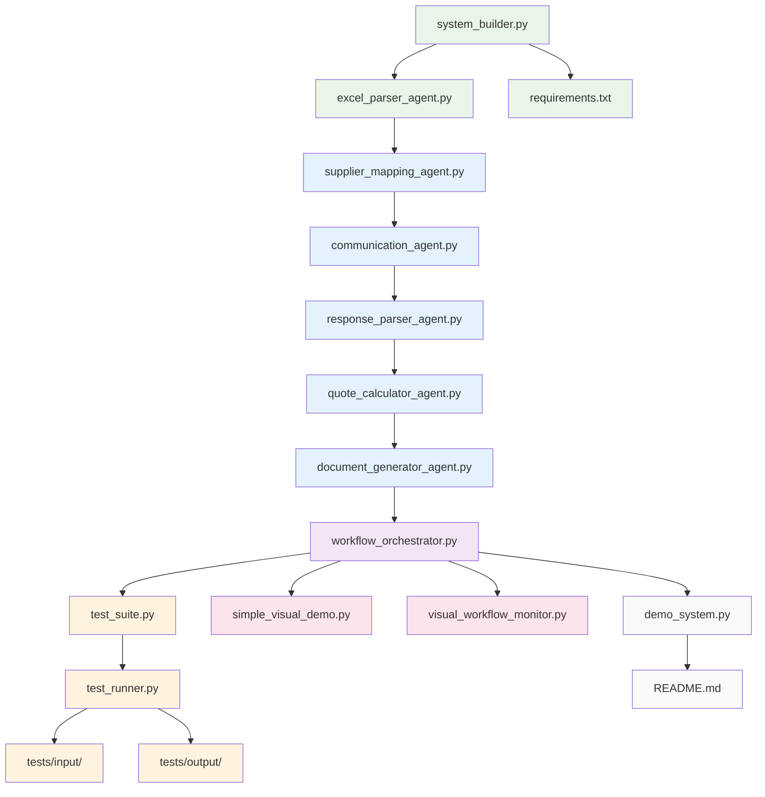
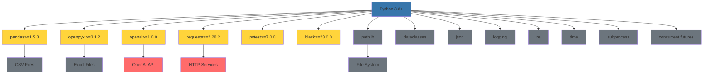
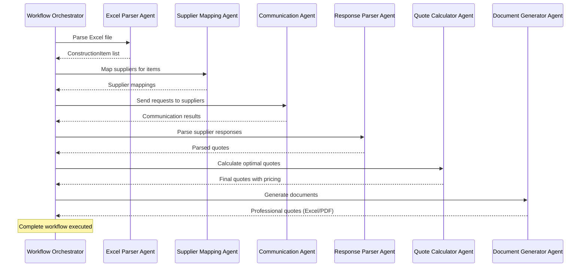
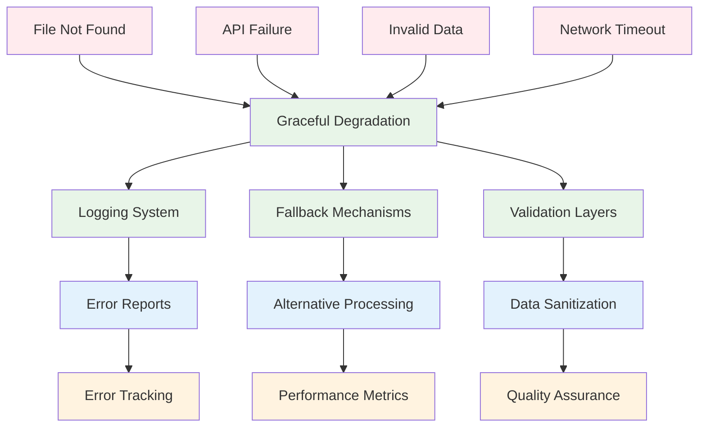
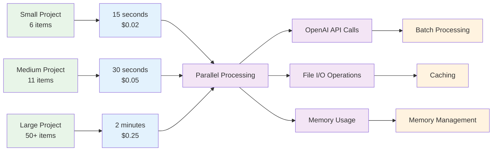

# Dependency Graph - Construction Industry Agents

## System Component Dependencies

```mermaid
graph TD
    %% Main Entry Points
    A[demo_system.py] --> B[workflow_orchestrator.py]
    A --> C[system_builder.py]
    
    %% Core Workflow Orchestrator Dependencies
    B --> D[excel_parser_agent.py]
    B --> E[supplier_mapping_agent.py]
    B --> F[communication_agent.py]
    B --> G[response_parser_agent.py]
    B --> H[quote_calculator_agent.py]
    B --> I[document_generator_agent.py]
    
    %% System Builder Dependencies
    C --> J[diagrams/complete_system_architecture.mmd]
    C --> K[diagrams/agent_workflow&data_flow.mmd]
    C --> D
    C --> E
    C --> F
    C --> G
    C --> H
    C --> I
    
    %% Agent Internal Dependencies
    D --> L[openai]
    D --> M[pandas]
    D --> N[openpyxl]
    D --> O[dataclasses]
    
    E --> P[dataclasses]
    E --> Q[json]
    E --> R[pathlib]
    
    F --> S[requests]
    F --> T[email]
    F --> U[dataclasses]
    F --> E
    
    G --> V[re]
    G --> W[json]
    G --> X[dataclasses]
    G --> F
    
    H --> Y[dataclasses]
    H --> Z[math]
    H --> AA[json]
    H --> G
    
    I --> BB[openpyxl]
    I --> CC[pandas]
    I --> DD[dataclasses]
    I --> H
    
    %% Testing Dependencies
    AB[test_suite.py] --> B
    AB --> D
    AB --> E
    AB --> F
    AB --> G
    AB --> H
    AB --> I
    
    AC[test_runner.py] --> AB
    AC --> AD[tests/input/]
    AC --> AE[tests/output/]
    
    %% Visual Components
    AF[simple_visual_demo.py] --> B
    AG[visual_workflow_monitor.py] --> B
    
    %% Data Dependencies
    AH[test_construction_spec.xlsx] --> D
    AI[demo_response.json] --> G
    
    %% Output Dependencies
    AJ[complete_workflow_output/] --> I
    AK[demo_output/] --> I
    AL[visual_workflow_output/] --> I
    
    %% Configuration Dependencies
    AM[requirements.txt] --> L
    AM --> M
    AM --> N
    AM --> S
    
    %% Documentation Dependencies
    AN[README.md] --> AO[diagrams/]
    AP[licence.md] --> AN
    
    %% Styling
    classDef entryPoint fill:#e1f5fe
    classDef coreAgent fill:#f3e5f5
    classDef dependency fill:#e8f5e8
    classDef test fill:#fff3e0
    classDef visual fill:#fce4ec
    classDef data fill:#f1f8e9
    classDef output fill:#e0f2f1
    classDef config fill:#fafafa
    
    class A,B,C entryPoint
    class D,E,F,G,H,I coreAgent
    class L,M,N,O,P,Q,R,S,T,U,V,W,X,Y,Z,AA,BB,CC,DD dependency
    class AB,AC,AD,AE test
    class AF,AG visual
    class AH,AI data
    class AJ,AK,AL output
    class AM,AN,AO,AP config
```

## Data Flow Dependencies

## Build Order Dependencies

## External Dependencies

## Agent Communication Dependencies

## Error Handling Dependencies

## Performance Dependencies

