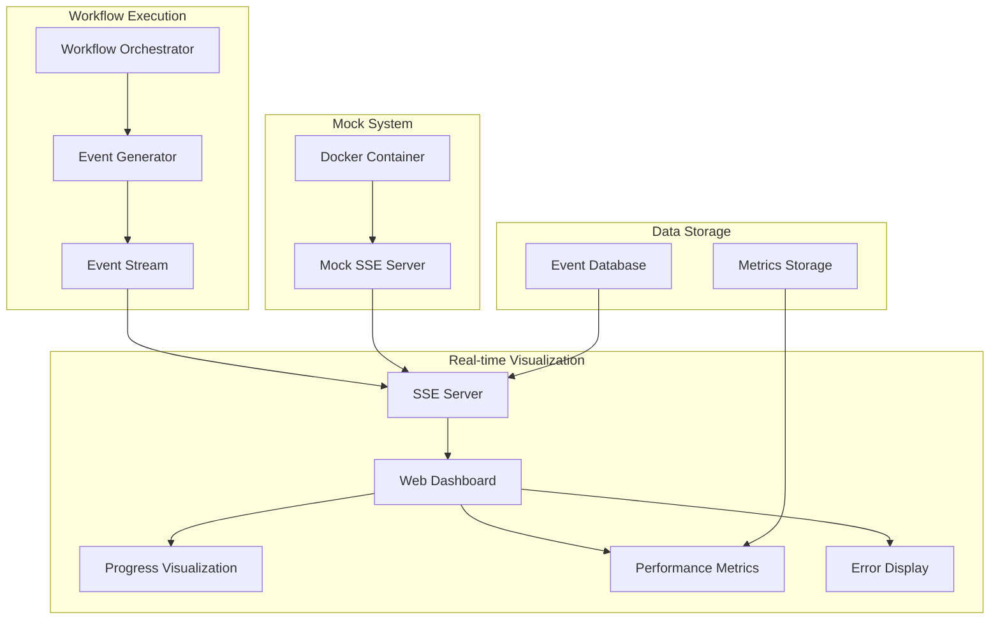

# Plan: v1 Realtime Workflow Visualization

## Overview

This plan outlines the implementation of the v1 "Realtime Workflow Visualization" feature for the Construction Industry Agents system. The feature will provide real-time monitoring and visualization of workflow execution, enabling users to track progress, identify bottlenecks, and monitor system performance.

## Feature Requirements

### Core Functionality
1. **Real-time Workflow Monitoring**: Track workflow execution in real-time
2. **Visual Progress Indicators**: Show progress through each agent
3. **Performance Metrics**: Display processing times and resource usage
4. **Error Visualization**: Highlight errors and issues
5. **Interactive Dashboard**: Web-based interface for monitoring

### Technical Requirements
1. **Server-Sent Events (SSE)**: Real-time data streaming
2. **Web Interface**: HTML/CSS/JavaScript dashboard
3. **Event System**: Workflow event generation and handling
4. **Data Persistence**: Store workflow events and metrics
5. **Mock SSE Stream**: Dockerized mock server for development

## Architecture Design

### System Components



### Event Flow
1. **Workflow Execution**: Orchestrator generates events
2. **Event Processing**: Events are formatted and streamed
3. **Real-time Delivery**: SSE delivers events to clients
4. **Visualization**: Dashboard renders events in real-time
5. **Data Persistence**: Events stored for historical analysis

## Implementation Plan

### Phase 1: Event System Foundation
**Duration**: 2-3 days

#### Tasks:
1. **Event Model Design**
   - Define workflow event structure
   - Create event types and categories
   - Implement event serialization

2. **Event Generator Integration**
   - Modify WorkflowOrchestrator to generate events
   - Add event hooks to each agent
   - Implement event context tracking

3. **Event Storage**
   - Design event database schema
   - Implement event persistence
   - Add event retrieval APIs

#### Deliverables:
- Event model classes
- Modified WorkflowOrchestrator
- Event storage implementation
- Unit tests for event system

### Phase 2: SSE Server Implementation
**Duration**: 2-3 days

#### Tasks:
1. **SSE Server Core**
   - Implement SSE server using Flask/FastAPI
   - Add event streaming endpoints
   - Implement client connection management

2. **Event Broadcasting**
   - Create event broadcast mechanism
   - Implement event filtering
   - Add subscription management

3. **Mock SSE Server**
   - Create mock event generator
   - Implement Docker containerization
   - Add configuration options

#### Deliverables:
- SSE server implementation
- Mock SSE server with Docker
- Event broadcasting system
- Integration tests

### Phase 3: Web Dashboard
**Duration**: 3-4 days

#### Tasks:
1. **Dashboard Framework**
   - Create HTML/CSS dashboard structure
   - Implement responsive design
   - Add navigation and layout

2. **Real-time Visualization**
   - Implement progress indicators
   - Add performance charts
   - Create error display components

3. **Interactive Features**
   - Add workflow control buttons
   - Implement filtering and search
   - Add export functionality

#### Deliverables:
- Web dashboard interface
- Real-time visualization components
- Interactive features
- Browser compatibility testing

### Phase 4: Integration and Testing
**Duration**: 2-3 days

#### Tasks:
1. **System Integration**
   - Integrate all components
   - Test end-to-end functionality
   - Optimize performance

2. **Testing and Validation**
   - Comprehensive testing suite
   - Performance testing
   - User acceptance testing

3. **Documentation and Deployment**
   - Update documentation
   - Create deployment scripts
   - Prepare user guides

#### Deliverables:
- Integrated system
- Test suite and results
- Updated documentation
- Deployment package

## Technical Specifications

### Event Model
```python
@dataclass
class WorkflowEvent:
    """Workflow event model"""
    event_id: str
    workflow_id: str
    timestamp: datetime
    event_type: str
    agent_name: str
    status: str
    message: str
    data: Dict[str, Any]
    duration: Optional[float] = None
    error: Optional[str] = None
```

### Event Types
- `workflow_started`: Workflow execution begins
- `agent_started`: Agent processing begins
- `agent_completed`: Agent processing completes
- `agent_error`: Agent encounters error
- `workflow_completed`: Workflow execution completes
- `performance_metric`: Performance data point

### SSE Server API
```python
# Endpoints
GET /events/stream          # SSE event stream
GET /events/history         # Historical events
GET /workflows/active       # Active workflows
GET /metrics/performance    # Performance metrics
```

### Web Dashboard Features
- **Real-time Progress**: Live progress indicators
- **Performance Charts**: Processing time and resource usage
- **Error Display**: Real-time error notifications
- **Workflow Control**: Start/stop/pause workflows
- **Historical View**: Past workflow analysis
- **Export Options**: Data export functionality

## Mock SSE Implementation

### Docker Configuration
```dockerfile
FROM python:3.8-slim

WORKDIR /app
COPY requirements.txt .
RUN pip install -r requirements.txt

COPY mock_sse_server.py .
COPY mock_events.py .

EXPOSE 8000

CMD ["python", "mock_sse_server.py"]
```

### Mock Event Generator
```python
class MockEventGenerator:
    """Generate mock workflow events for testing"""
    
    def __init__(self, event_types: List[str]):
        self.event_types = event_types
        self.workflow_id = f"MOCK_WORKFLOW_{int(time.time())}"
    
    def generate_events(self):
        """Generate mock events"""
        # Implementation for generating realistic mock events
```

## Success Criteria

### Functional Requirements
- [ ] Real-time workflow monitoring
- [ ] Visual progress indicators
- [ ] Performance metrics display
- [ ] Error visualization
- [ ] Interactive dashboard
- [ ] Mock SSE server with Docker

### Performance Requirements
- [ ] Sub-second event delivery
- [ ] Support for 100+ concurrent users
- [ ] Dashboard loads in <2 seconds
- [ ] Memory usage <500MB
- [ ] CPU usage <10% during normal operation

### Quality Requirements
- [ ] 95%+ test coverage
- [ ] Zero critical bugs
- [ ] Responsive design (mobile-friendly)
- [ ] Cross-browser compatibility
- [ ] Comprehensive error handling

## Risk Mitigation

### Technical Risks
1. **SSE Connection Stability**
   - Implement connection retry logic
   - Add heartbeat mechanisms
   - Monitor connection health

2. **Performance Impact**
   - Optimize event generation
   - Implement event batching
   - Add performance monitoring

3. **Browser Compatibility**
   - Test across major browsers
   - Implement fallback mechanisms
   - Add polyfills where needed

### Operational Risks
1. **Data Volume**
   - Implement event archiving
   - Add data retention policies
   - Optimize storage usage

2. **Security**
   - Implement authentication
   - Add event filtering
   - Secure SSE connections

## Timeline

### Week 1: Foundation
- Days 1-2: Event system design and implementation
- Days 3-4: SSE server core functionality
- Day 5: Mock SSE server and Docker setup

### Week 2: Dashboard Development
- Days 1-3: Web dashboard implementation
- Days 4-5: Real-time visualization components

### Week 3: Integration and Testing
- Days 1-2: System integration
- Days 3-4: Testing and optimization
- Day 5: Documentation and deployment

## Resource Requirements

### Development Team
- 1 Backend Developer (Python/Flask)
- 1 Frontend Developer (HTML/CSS/JavaScript)
- 1 DevOps Engineer (Docker/Deployment)

### Infrastructure
- Development server
- Docker environment
- Testing environment
- Performance testing tools

### Tools and Libraries
- Flask/FastAPI for SSE server
- HTML5/CSS3/JavaScript for dashboard
- Chart.js for visualizations
- Docker for containerization
- Pytest for testing

## Conclusion

This plan provides a comprehensive roadmap for implementing the v1 Realtime Workflow Visualization feature. The implementation follows the system's modular architecture and leverages existing components while adding new real-time capabilities.

The feature will significantly enhance the user experience by providing real-time visibility into workflow execution, enabling better monitoring, debugging, and optimization of the Construction Industry Agents system. 