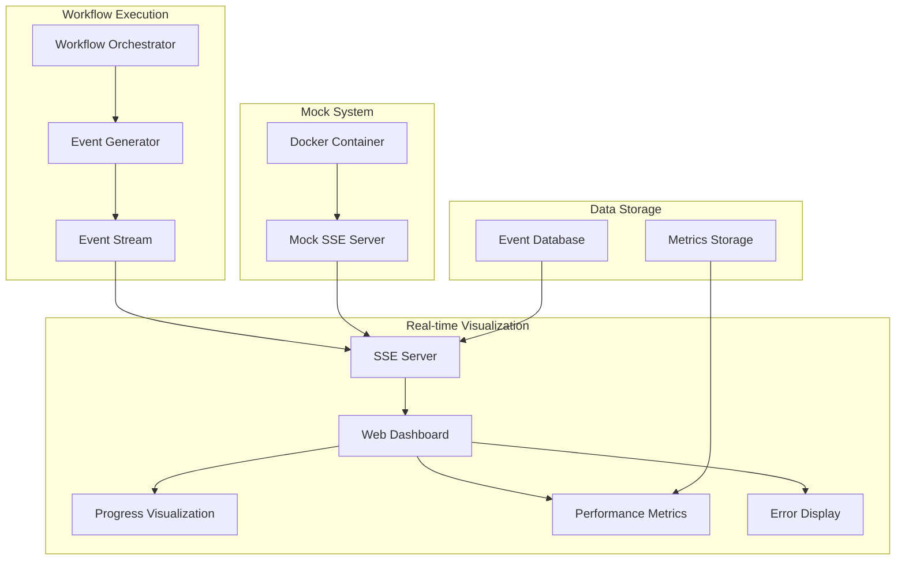

# Realtime Workflow Visualization - v1

## Overview

The Realtime Workflow Visualization feature provides real-time monitoring and visualization of the Construction Industry Agents system. It enables users to track workflow execution progress, monitor performance metrics, and visualize system activity in real-time.

## Features

### 🎯 Core Functionality
- **Real-time Workflow Monitoring**: Track workflow execution as it happens
- **Visual Progress Indicators**: See progress through each agent in real-time
- **Performance Metrics**: Monitor processing times and resource usage
- **Error Visualization**: Highlight errors and issues immediately
- **Interactive Dashboard**: Web-based interface for monitoring

### 🔧 Technical Features
- **Server-Sent Events (SSE)**: Real-time data streaming
- **Event System**: Comprehensive workflow event generation and handling
- **Data Persistence**: Store workflow events and metrics
- **Mock SSE Stream**: Dockerized mock server for development and testing
- **Responsive Design**: Mobile-friendly dashboard interface

## Architecture

### System Components



### Event Flow
1. **Workflow Execution**: Orchestrator generates events during processing
2. **Event Processing**: Events are formatted and streamed via SSE
3. **Real-time Delivery**: SSE delivers events to connected clients
4. **Visualization**: Dashboard renders events in real-time
5. **Data Persistence**: Events stored for historical analysis

## Quick Start

### Prerequisites
- Python 3.8 or higher
- Docker (optional, for containerized deployment)
- Modern web browser with SSE support

### Installation

#### Option 1: Local Development
```bash
# Clone the repository
git clone https://github.com/Prosperity-labs/construction-industry-agents.git
cd construction-industry-agents

# Install dependencies
pip install -r requirements.txt

# Run the mock SSE server
python mock_sse_server.py
```

#### Option 2: Docker Deployment
```bash
# Build and run with Docker Compose
docker-compose up mock-sse-server

# Or build manually
docker build -t construction-agents-mock-sse .
docker run -p 8000:8000 construction-agents-mock-sse
```

### Access the Dashboard
Open your web browser and navigate to:
```
http://localhost:8000
```

## Usage

### Dashboard Interface

The dashboard provides several key sections:

#### 1. Metrics Overview
- **Active Workflows**: Number of currently running workflows
- **Connected Clients**: Number of clients connected to SSE stream
- **Events Generated**: Total number of events processed
- **System Status**: Current system health status

#### 2. Mock Controls
- **Start Mock Workflow**: Trigger a simulated workflow execution
- **Generate Random Event**: Create a random workflow event
- **Clear Events**: Clear the event display
- **Enable Auto Mode**: Automatically generate events

#### 3. Real-time Events
- Live display of workflow events as they occur
- Color-coded status indicators (success, error, progress, info)
- Timestamp and agent information for each event

### API Endpoints

#### SSE Stream
```
GET /events/stream
```
Real-time Server-Sent Events stream for workflow events.

#### Event History
```
GET /events/history?limit=50&workflow_id=WORKFLOW_ID
```
Retrieve historical events with optional filtering.

#### Active Workflows
```
GET /workflows/active
```
Get list of currently active workflows.

#### Performance Metrics
```
GET /metrics/performance
```
Get system performance metrics.

#### Health Check
```
GET /health
```
System health status and basic metrics.

#### Mock Workflow Control
```
POST /mock/start-workflow
```
Start a mock workflow simulation.

## Event System

### Event Types

The system generates various types of events:

- **workflow_started**: Workflow execution begins
- **workflow_completed**: Workflow execution completes
- **workflow_error**: Workflow encounters an error
- **agent_started**: Agent processing begins
- **agent_completed**: Agent processing completes
- **agent_error**: Agent encounters an error
- **performance_metric**: Performance data point
- **progress_update**: Progress update during processing
- **status_update**: General status update

### Event Structure

```json
{
  "event_id": "unique-event-id",
  "workflow_id": "workflow-identifier",
  "timestamp": "2023-12-01T10:30:00Z",
  "event_type": "agent_started",
  "agent_name": "excel_parser_agent",
  "status": "progress",
  "message": "Excel Parser Agent processing started",
  "data": {
    "file": "construction_spec.xlsx",
    "items_to_process": 15
  },
  "duration": 2.5,
  "error": null,
  "metadata": {
    "source": "mock_server",
    "version": "1.0"
  }
}
```

## Development

### Project Structure
```
construction-industry-agents/
├── workflow_events.py          # Event system core
├── sse_server.py              # SSE server implementation
├── mock_sse_server.py         # Mock server for testing
├── test_realtime_visualization.py  # Test suite
├── Dockerfile                 # Docker configuration
├── docker-compose.yml         # Docker Compose setup
└── requirements.txt           # Python dependencies
```

### Running Tests
```bash
# Run the test suite
python test_realtime_visualization.py

# Run with verbose output
python test_realtime_visualization.py --verbose

# Test against different server
python test_realtime_visualization.py --url http://localhost:8001
```

### Development Workflow

1. **Start Development Server**:
   ```bash
   python mock_sse_server.py
   ```

2. **Access Dashboard**: Open `http://localhost:8000`

3. **Test Functionality**: Use the mock controls to generate events

4. **Monitor Logs**: Check console output for event generation

5. **Run Tests**: Execute the test suite to verify functionality

## Configuration

### Environment Variables

| Variable | Default | Description |
|----------|---------|-------------|
| `MOCK_SSE_HOST` | `0.0.0.0` | Server host address |
| `MOCK_SSE_PORT` | `8000` | Server port number |
| `PYTHONUNBUFFERED` | `1` | Python output buffering |

### Docker Configuration

The Docker setup includes:

- **Base Image**: Python 3.8-slim
- **Security**: Non-root user execution
- **Health Checks**: Automatic health monitoring
- **Port Exposure**: Port 8000 for web access
- **Volume Mounts**: Log directory persistence

## Monitoring and Observability

### Health Checks
The system provides comprehensive health monitoring:

```bash
# Check system health
curl http://localhost:8000/health

# Response example:
{
  "status": "healthy",
  "timestamp": "2023-12-01T10:30:00Z",
  "subscribers": 2,
  "active_workflows": 1,
  "mock_server": true
}
```

### Performance Metrics
Monitor system performance through the metrics endpoint:

```bash
curl http://localhost:8000/metrics/performance
```

### Logging
The system provides detailed logging for debugging:

- **Event Generation**: All events are logged
- **Connection Management**: SSE client connections
- **Error Handling**: Detailed error information
- **Performance**: Processing times and metrics

## Troubleshooting

### Common Issues

#### 1. Server Not Starting
```bash
# Check if port is already in use
lsof -i :8000

# Kill existing process
kill -9 <PID>

# Restart server
python mock_sse_server.py
```

#### 2. SSE Connection Issues
- Ensure browser supports Server-Sent Events
- Check network connectivity
- Verify CORS settings if accessing from different domain

#### 3. Docker Issues
```bash
# Check container status
docker ps

# View container logs
docker logs construction-agents-mock-sse

# Restart container
docker-compose restart mock-sse-server
```

#### 4. Event Not Displaying
- Check browser console for JavaScript errors
- Verify SSE connection is established
- Ensure events are being generated

### Debug Mode
Enable debug mode for detailed logging:

```python
# In mock_sse_server.py
logging.basicConfig(level=logging.DEBUG)
```

## Performance Considerations

### Scalability
- **Concurrent Connections**: Supports multiple SSE clients
- **Event Batching**: Efficient event processing
- **Memory Management**: Automatic cleanup of old events
- **Database Optimization**: Indexed queries for performance

### Optimization Tips
1. **Limit Event History**: Use appropriate limits for event retrieval
2. **Monitor Memory Usage**: Watch for memory leaks in long-running sessions
3. **Connection Management**: Properly close SSE connections
4. **Error Handling**: Implement retry logic for failed connections

## Security

### Best Practices
- **Input Validation**: All inputs are validated
- **CORS Configuration**: Proper cross-origin resource sharing
- **Error Handling**: No sensitive information in error messages
- **Docker Security**: Non-root user execution

### Production Deployment
For production deployment, consider:

1. **HTTPS**: Use SSL/TLS encryption
2. **Authentication**: Implement user authentication
3. **Rate Limiting**: Prevent abuse
4. **Monitoring**: Add comprehensive monitoring
5. **Backup**: Regular data backups

## Future Enhancements

### Planned Features
- **Real-time Charts**: Interactive performance charts
- **Alert System**: Configurable alerts for specific events
- **Export Functionality**: Export events and metrics
- **Mobile App**: Native mobile application
- **Advanced Filtering**: Complex event filtering and search

### Integration Opportunities
- **Prometheus**: Metrics collection and alerting
- **Grafana**: Advanced visualization dashboards
- **ELK Stack**: Log aggregation and analysis
- **Slack/Teams**: Real-time notifications

## Contributing

### Development Setup
1. Fork the repository
2. Create a feature branch
3. Make your changes
4. Add tests for new functionality
5. Submit a pull request

### Testing Guidelines
- Write tests for all new features
- Ensure existing tests pass
- Test with different browsers
- Verify SSE functionality

### Code Style
- Follow PEP 8 guidelines
- Add type hints where appropriate
- Include docstrings for all functions
- Use meaningful variable names

## Support

### Getting Help
- **Documentation**: Check this README and inline code comments
- **Issues**: Report bugs and feature requests via GitHub issues
- **Testing**: Use the provided test suite to verify functionality

### Community
- **Discussions**: Join GitHub discussions for questions
- **Contributions**: Submit pull requests for improvements
- **Feedback**: Share your experience and suggestions

## License

This feature is part of the Construction Industry Agents project. See the main project LICENSE file for details.

---

**Note**: This is the v1 implementation of the Realtime Workflow Visualization feature. Future versions will include additional functionality and improvements based on user feedback and requirements. 